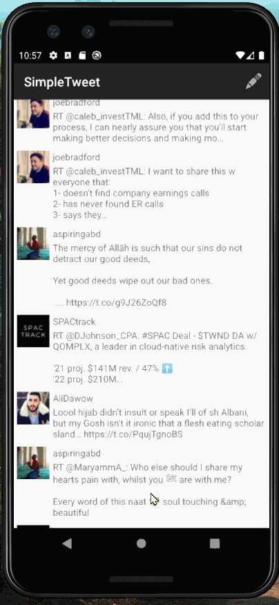

# SimpleTweet
 A Twitter-esque app which displays the Tweets timeline of a user!

## Here's a walkthrough of the app in Portrait mode:

Submitted by: **Umar Kagzi**

Time spent: **10** hours spent in total

## User Stories

The following **required** functionality is completed:

* [x] All required items are included.

The following **additional** features are implemented:

* [x] Enhanced UI, Landscape Mode

## Notes

Describe any challenges encountered while building the app.

I did encounter a few hurdles while building the app but was able to resolve the issues by reading the documentation and user feedback.

## License

    Copyright [2021] [Umar Kagzi]

    Licensed under the MIT License.
